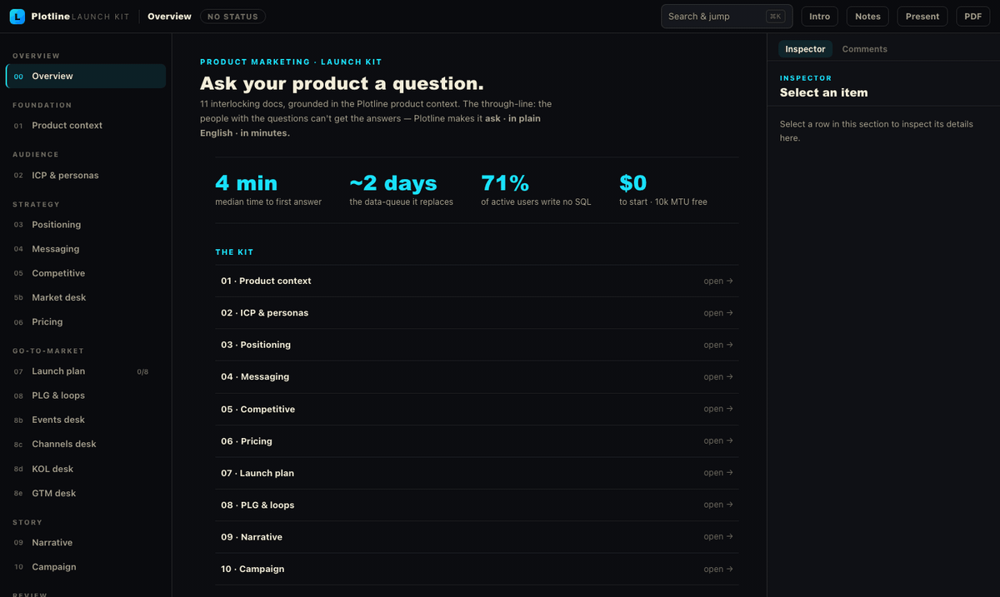
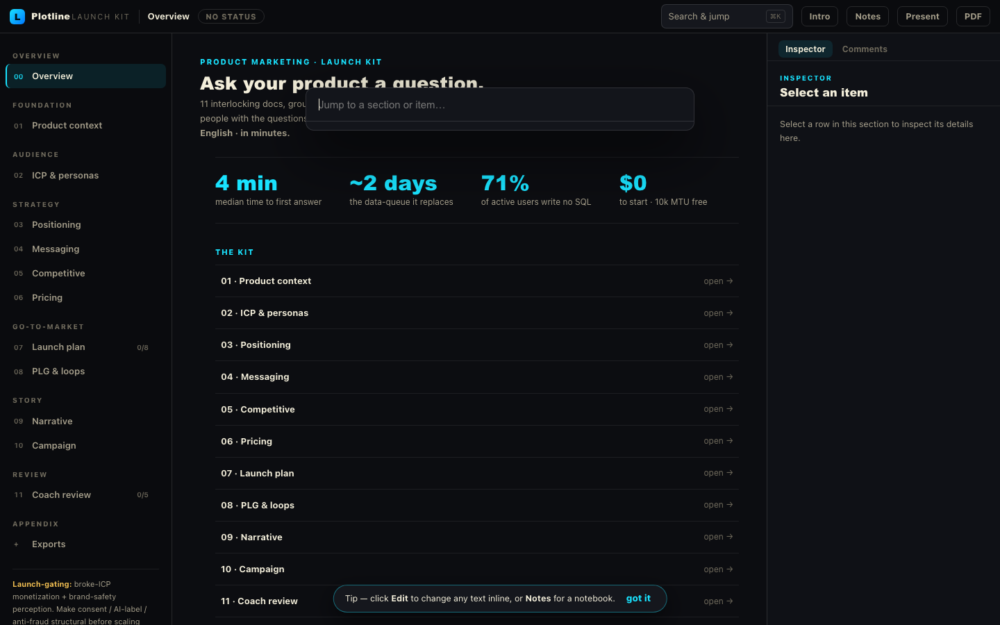
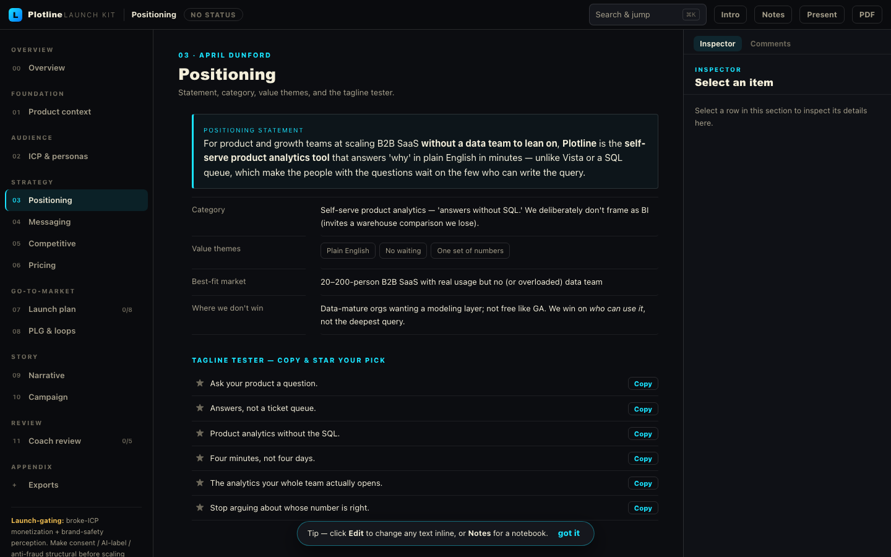
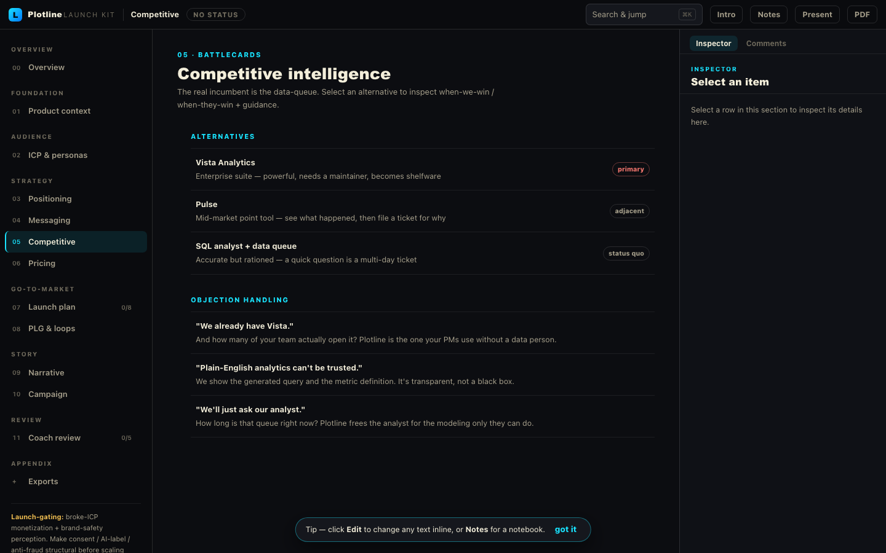
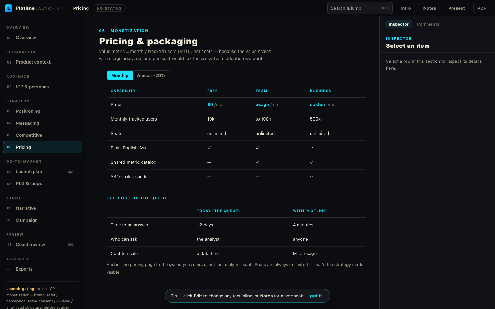
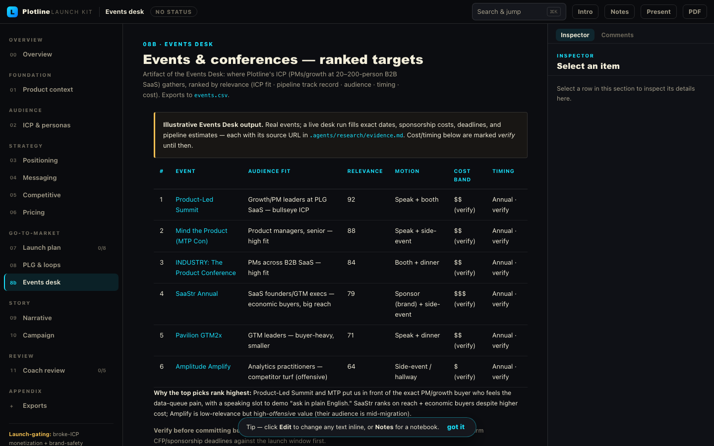
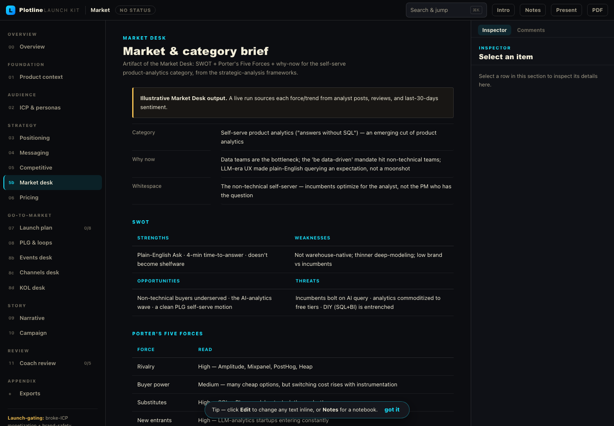

<div align="center">

# PMM OS — Product Marketing Operating System

**Turn a product brief into positioning, messaging, personas, pricing, competitive intel, and a full launch plan — then package the whole thing into a shippable, interactive launch kit. Without leaving your terminal.**

A Claude Code / Codex plugin: **40+ product-marketing, GTM & PLG skills**, **two built-in research engines**, a deep framework library, and a zero-dependency generator that turns strategy into an app.



</div>

---

## Why it exists

Most "marketing AI" gives you a wall of generic advice. PMM OS gives you **decisions and artifacts**: it grounds every output in your product context, applies real frameworks (April Dunford positioning, JTBD personas, value-metric pricing, win/loss CI), holds a strict depth bar so nothing comes back as a one-line stub, and ends a launch with something you can actually hand to a team.

It behaves like **one product**, not 40 band-aided prompts: shared context, one depth standard, one framework library, and a chain that always flows to a finished deliverable.

## The launch kit — what you actually ship

Every launch ends with a single **self-contained, offline HTML app** (no dependencies, no build step to view it): a left sidebar, a main workspace, and a right inspector — plus a ⌘K command palette, present/deck mode, status tracking, and a one-click live editor (rich text, slash-insert, drag-reorder, highlight→comment) that writes changes back to source.

<div align="center">

**⌘K command palette — jump to any section, persona, pillar, or battlecard**



</div>

| Positioning | Competitive | Pricing |
|:--:|:--:|:--:|
|  |  |  |

> The screenshots above are a **real, end-to-end launch** PMM OS produced for a fictional company (*Plotline* — self-serve product analytics). The whole thing — positioning statement, message house, battlecards, pricing logic, GTM plan, PLG loops, coach review — lives in one [`kit-content.json`](demo/plotline-launch/kit-content.json) and builds to one HTML file. Open [`demo/plotline-launch/`](demo/plotline-launch/) to click through it.

## Quick start

```bash
# one command (npm)
npx pmm-os install

# — or straight from GitHub, inside Claude Code —
/plugin marketplace add buildingwithai/pmm-os
```

Then, in Claude Code:

```bash
# run the whole chain (grounding → research → strategy → … → launch kit)
/product-marketing-os

# or jump straight to a specialist
/pmm-positioning-exercise
/pmm-pricing-packaging
/pmm-launch-kit
```

`npx pmm-os doctor` checks your environment; `npx pmm-os update` upgrades; the first session
auto-installs the research engines in the background. Ask for a launch and PMM OS produces the
strategy **and** the clickable kit — markdown alone is never the finish line.

## The quality architecture (v3) — the consulting-grade bar

v3 wires a consulting-grade operating discipline through the whole pipeline, distilled from the
MBB working canon and field-researched one-pager formats:

- **The two-product contract** — every engagement ships the **research library** (cited,
  two-altitude desks; every claim clicks through to its source) *and* the **deliverable suite**
  (positioning one-pager, messaging house, persona cards, battlecards with VARS objection
  handling, pricing, GTM-on-a-page — each backed by a working doc whose claims `@`-link to the
  findings that justify them).
- **Stage 0 product grounding** — when your product has a codebase, the code is read *first*;
  capability claims cite `path:line`. Truth order: code > founder artifacts > description.
- **The Plan gate** — no research call before a day-1 hypothesis (with named kill conditions)
  and a MECE issue tree exist. Pivots are logged, never silent.
- **The adversarial pass** — every desk hunts for evidence *against* its own finding before it
  closes. Refuting the hypothesis is a valid, valuable outcome.
- **The score gate** — deliverables ship at ≥24/33 on an 11-row scorecard (answer-first, action
  titles, so-what density, typed + dated evidence, honesty…), coach-reviewed, weakest row first.
- **The workspace** — the launch kit is a Notion-shaped research workspace: filterable Findings /
  Evidence / Events databases, a side peek that opens any citation's source record, `@`-mentions
  with backlinks, markdown shortcuts, and an in-kit **Generate with AI** queue that a Claude Code
  session fulfills against the evidence.

## What's inside

**45 skills**, organized as one system:

| Area | Skills |
|---|---|
| **Research (built-in)** | `pmm-research-brief` · `pmm-research-desk` · `last30days` · `agent-reach` |
| **Orchestrators** | `product-marketing-os` · `agentic-marketing-orchestrator` · `product-lifecycle-os` · `plg-gtm-strategy` |
| **Positioning & messaging** | `pmm-positioning-exercise` · `pmm-positioning-audit` · `pmm-messaging-positioning` · `pmm-messaging-hierarchy` · `pmm-message-market-fit` · `pmm-adaptive-messaging` |
| **Research & audience** | `pmm-customer-research` · `pmm-personas` · `pmm-icp-definition` · `pmm-voc-synthesis` · `pmm-product-context` |
| **Competitive** | `pmm-competitive-intelligence` · `pmm-battlecard` · `pmm-competitive-landing-page` |
| **Pricing** | `pmm-pricing-packaging` · `pmm-pricing-analysis` |
| **Launch & GTM** | `pmm-go-to-market` · `pmm-launch-brief` · `pmm-campaign-brief` · `pmm-feature-announcement` · `post-launch-learning-loop` |
| **Sales & GTM engineering** | `sales-enablement` · `pmm-sales-narrative` · `pmm-outreach` · `gtm-account-research` · `gtm-icp-scoring` · `gtm-signal-campaign` · `gtm-weekly-context-update` |
| **Content & SEO/AEO** | `pmm-content-writer` · `pmm-aeo-geo` · `osp-value-map` · `osp-content-optimizer` · `osp-technical-marketing` |
| **Production** | `pmm-artifact-factory` · `pmm-launch-kit` · `prd-prototype-factory` · `pmm-coach` |

Three things make them work as a unit:

- **A deep framework library** — ~76k lines of frameworks, worksheets, templates, checklists and glossaries across 9 domains (positioning, messaging, competitive intelligence, personas, pricing, product launch, rollout, sales enablement, strategic thinking). 39/40 skills cite the exact docs they apply.
- **One depth standard** — every section must be *specific, complete, reasoned, and evidenced* — never a generic one-liner. Enforced in the skills, the prompt hook, and a final QA gate. "Depth is not length" — it won't pad, it goes deeper.
- **Smart routing** — sharpened, disambiguated triggers ("use this, not that") plus a hook that surfaces the right skills and always routes a launch to the interactive kit.

## Built-in research (two engines, on purpose)

Good marketing starts with what real people actually say. PMM OS ships **two
independent, complementary research engines** — run them separately and you get two
source pools instead of one:

- **`last30days`** — an *engagement-ranked, last-30-days* engine. Pulls Reddit, X,
  YouTube, TikTok, Hacker News, Polymarket, and GitHub, **scores by upvotes, likes,
  and real money**, and synthesizes a brief with verbatim community quotes. Best for
  *"what are people actually saying / sentiment / what's trending."* Self-contained
  Python (3.12+); Reddit/HN/Polymarket/GitHub work zero-config.
- **`agent-reach`** — a *breadth-first fetch/read router* across 13 platforms, strong
  exactly where the other is thin: **GitHub/dev, video transcripts, reading any URL,
  and Chinese platforms** (XiaoHongShu, Bilibili, Xueqiu, V2EX, Xiaoyuzhou). Best for
  *"fetch/read this, search this platform."* First run self-installs via
  `bash skills/agent-reach/scripts/setup.sh`.

Both are vendored into the plugin so research works on a fresh marketplace install
with **no quality degradation** — same depth as running them standalone. Refresh from
upstream anytime with `bash scripts/sync-research-engines.sh`. For VoC, competitive,
or any "what do people think" task, PMM OS runs **both** and synthesizes.

## Research Desks — research that produces artifacts

**It starts with a brain-dump.** You rarely have clean parameters — you have *"I've got a
product called X, it does A/B/C, I want to launch it."* `pmm-research-brief` is the front
door: it distills that ramble into a **Product Brief** + a **complete, mandatory Research
Plan across all nine desks** (product, customer, competitive, market, pricing, channels,
analyst/KOL, events, GTM/launch) — scoped with named competitors, segment, and events —
then runs the full sweep. Nothing is optional; a thorough PMM researches all of it. From there:

Research isn't one undifferentiated blob. A **research desk** (`pmm-research-desk`) is a
domain owned by a senior specialist's head. It loads that specialist's question set,
**fans it out across both engines** (~15–30 scoped calls — neither engine takes a batch,
so the desk decomposes), captures **sourced** evidence into `.agents/research/evidence.md`,
and emits a structured **artifact** into the dashboard. The Events Desk, for example,
ranks the conferences your ICP actually attends, by relevance vs. cost:



That artifact is built from a template the skills already carry (the plugin ships 38 of
them — battlecards, canvases, pricing matrices, RACI…), hydrated by the evidence.

**All nine desks ship** — product, customer, competitive, market, pricing, channels,
analyst/influencer, events, and GTM/launch — each producing its skill's *real* deliverable
in the dashboard (a competitor matrix + battlecard, a persona one-pager + ICP, a pricing
comparables matrix, a SWOT / Five-Forces / PESTEL category brief, a ranked channel map, a
KOL list, a ranked events table, a launch-tactics map…):



And research is the **hard gate** before strategy: a launch / positioning / pricing
deliverable won't ship until the desks that feed it have run and the ledger holds their
sourced sections — so output is grounded and cited, never invented.

## How a launch flows

```
brain-dump → research brief → research desks → positioning → messaging → pricing → competitive
      → GTM plan → artifacts → PMM Coach review → ✅ interactive launch kit → measurement → iteration
```

A launch or GTM motion **always** ends by building the kit (the wiring makes it the required final step), so you finish with a clickable hub, not a folder of docs.

## Build a kit from your own strategy

The generator is zero-dependency Node. Author one `kit-content.json` and build — no copying:

```bash
node skills/pmm-launch-kit/scripts/build-kit.mjs <your-launch-folder>
# → <wordmark>-launch-kit.html  +  generated-docs/*.md  +  deck.md (Marp → pptx/pdf)
```

Everything is one source of truth: `kit-content.json` → HTML app + markdown mirrors + a slide deck, all driven by a uniform block registry, so new block types and new export targets are additive.

## Marketing site

A full marketing site for PMM OS lives in [`website/`](website/) (Next.js) and embeds the live launch kit as its product demo.

## Credits & license

MIT © Jovanny Tovar. PMM OS adapts and unifies a number of open marketing skill sets — most notably the deep PMM framework library from [`buildingwithai/skills`](https://github.com/buildingwithai/skills) (MIT) — and includes methodology from Open Strategy Partners (CC BY-SA 4.0). All upstream attributions are preserved in [`THIRD_PARTY_NOTICES.md`](THIRD_PARTY_NOTICES.md). See [`LICENSE`](LICENSE).
