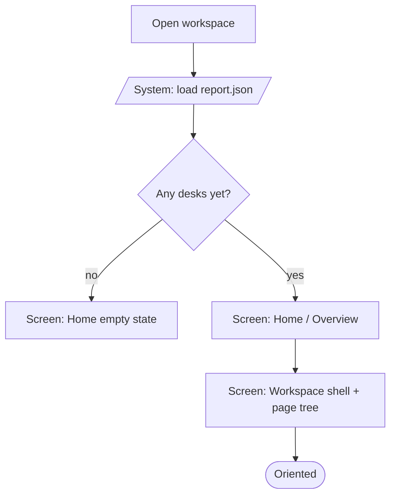
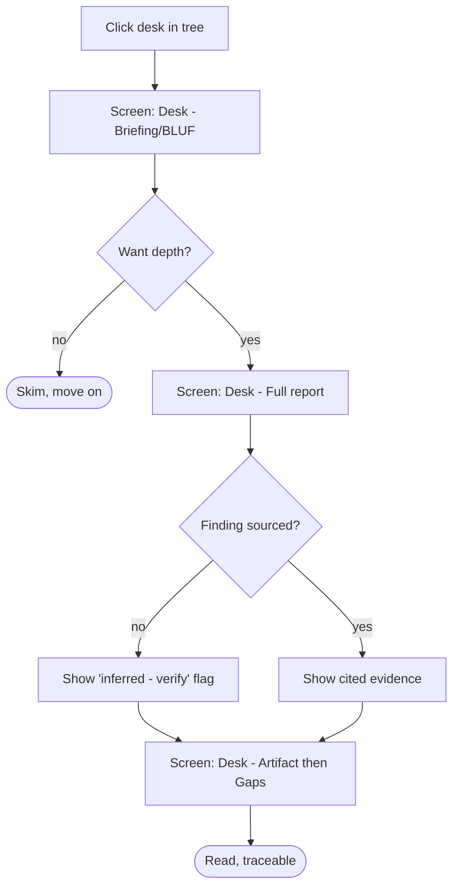
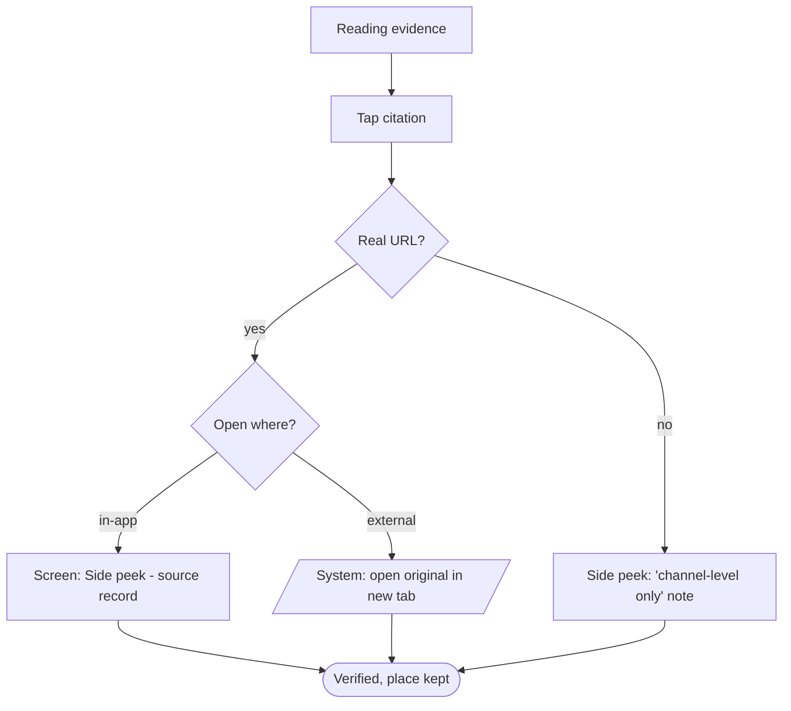
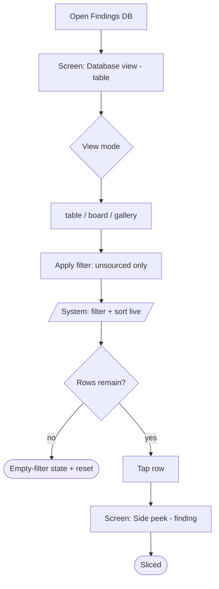
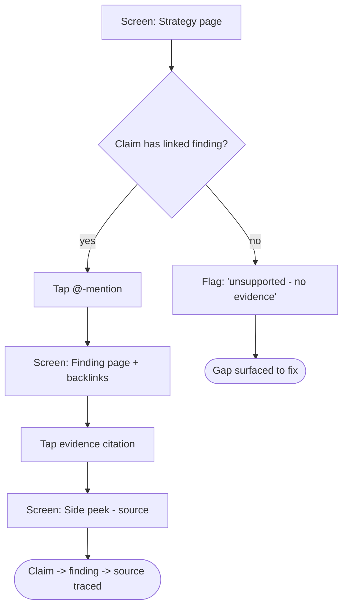
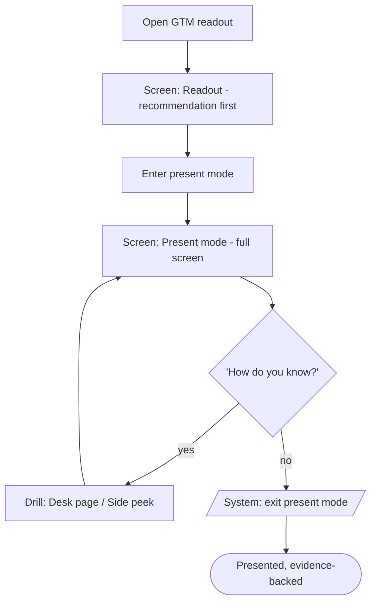
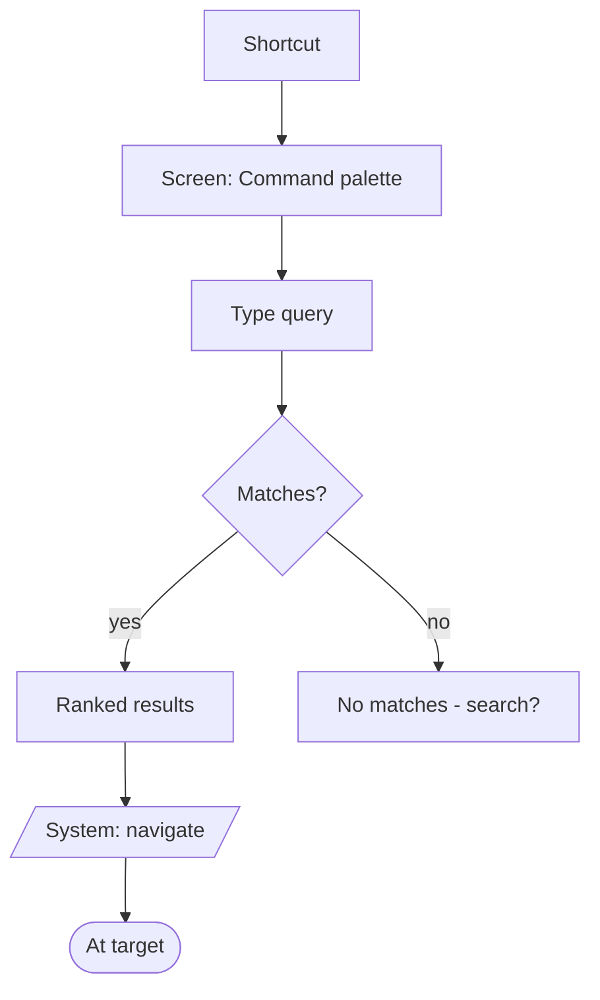
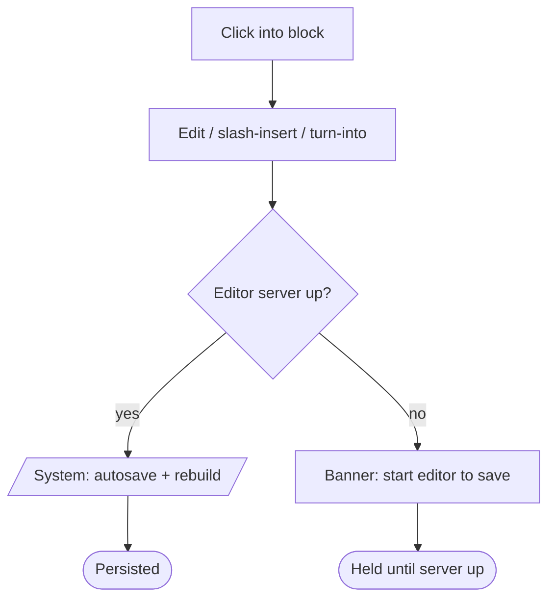
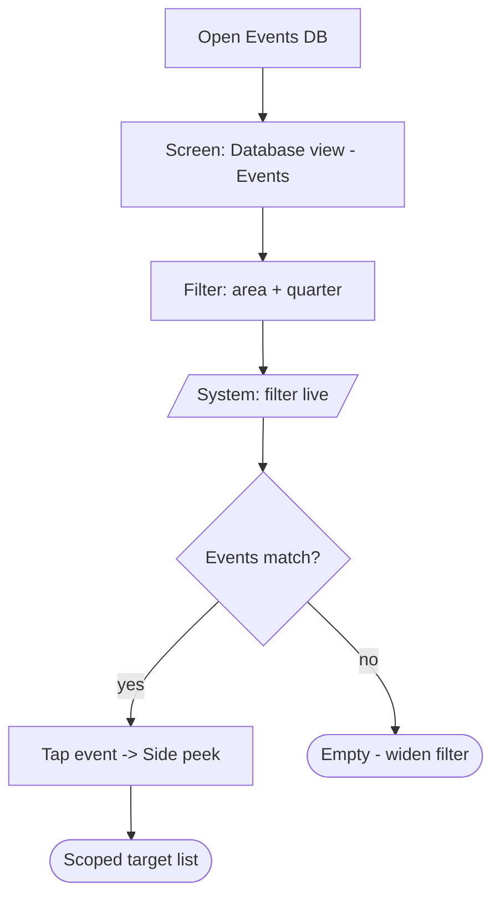

# User Flows: PMM OS Research Workspace

One flow per Must journey, walked entry → done with both branches (the unhappy/empty branch is
where screens get forgotten). Node conventions: `[Screen: name]` · `{Decision?}` ·
`[/System: action/]` · `([End state])`. The deduped screen list at the end feeds Phase 4.

---

## Flow 1: Open & orient
Entry: open the workspace HTML (the PMM author starts a working or presenting session).

1. [/System: load kit-content.json + report.json/]
2. Decision: has the project any desks/findings yet? → no: empty workspace
3. Screen: Home / Overview — executive summary (findings that change strategy) + project health (desk completion, citation coverage, what's thin/blocked)
4. Screen: Workspace shell — left page tree (Project → Desks → finding pages), main pane, collapsed right peek
5. End: oriented, a desk one click away  |  Empty: Home shows "No research yet — run a desk" with the run command

Screens touched: Workspace shell, Home / Overview

---

## Flow 2: Read a desk (the two-altitude report)
Entry: click a desk in the page tree (Flow 1).

1. Screen: Desk page — opens at the **Briefing** (one-line BLUF + 3–5 highlights)
2. Decision: want depth? → no: skim BLUF, jump to next desk / yes: continue
3. Screen: Desk page → **Full research report** — each finding as Insight → Evidence (cited block) → Implication
4. Decision: finding is unsourced/inferred? → yes: it shows an "inferred — verify" flag / no: shows its citations
5. Screen: Desk page → **Artifact** (matrix / table / personas), then **Gaps & verify** at the end
6. End: read at the altitude they wanted, every claim traceable  |  Thin: a desk with no findings shows "Not yet researched — run this desk"

Screens touched: Desk page

---

## Flow 3: Verify a finding (chain of evidence)
Entry: reading a finding's cited evidence in a desk (Flow 2).

1. Screen: Desk page — evidence item shows verbatim quote + who + channel + metric + source link
2. Tap the citation
3. Decision: source has a real URL? → yes: open it / no: show "source captured at channel level only — not linkable"
4. Decision: open where? → in-app peek (default) or new browser tab (external URL)
5. Screen: Side peek — the source record (quote, channel, metric, "backs these findings", open-original button)
6. End: claim verified in context, place kept  |  Fail: no URL → peek explains the gap honestly

Screens touched: Desk page, Side peek (source record)

---

## Flow 4: Slice the research (database view)
Entry: command palette or tree → "Findings" (also Evidence, Events).

1. Screen: Database view — Findings as a table (columns: finding, desk, sourced?, confidence, implication)
2. Decision: view mode? → table (default) / board (by desk) / gallery
3. Apply filter: "unsourced only" (or by desk / confidence / segment)
4. [/System: filter + sort rows live/]
5. Decision: rows remain? → yes: scan / no: empty-filter state ("no unsourced findings — all traceable")
6. Tap a row → Screen: Side peek (finding record) → optional jump to its full page
7. End: research sliced to the question (e.g. every weak spot)  |  Empty: clear empty-filter message, one tap to reset

Screens touched: Database view, Side peek (finding record), Finding page

---

## Flow 5: Trace a claim (backlinks & mentions)
Entry: reading a strategy/positioning/messaging page with claims.

1. Screen: Strategy page — a claim contains an @-mention of a finding
2. Decision: claim has a linked finding? → no: it's flagged "unsupported — no linked evidence" / yes: continue
3. Tap the @-mention → Screen: Finding page (the supporting finding)
4. Screen: Finding page → "Referenced by" backlinks (which claims cite this finding) + its own evidence
5. Tap an evidence citation → Flow 3 (verify the source)
6. End: claim → finding → source chain followed end to end  |  Gap: unsupported claim surfaced for fixing

Screens touched: Strategy page, Finding page, Side peek (source)

---

## Flow 6: Present the GTM readout
Entry: tree/palette → "GTM readout" (the PMM about to present to stakeholders).

1. Screen: GTM readout — opens answer-first (Recommendation), then SCQA, plan, metrics, risks
2. Enter present/deck mode
3. Screen: Present mode — one section full-screen, next/prev, progress
4. Decision: stakeholder asks "how do you know?" → yes: drill / no: continue
5. Screen: drill to the backing Desk page or Side peek (source) mid-presentation, then return to the same slide
6. [/System: exit present mode/]
7. End: strategy presented answer-first, evidence one tap away  |  Fail (no readout yet): "Run the desks to generate the readout"

Screens touched: GTM readout, Present mode, Desk page, Side peek

---

## Flow 7: Jump anywhere (command palette)
Entry: keyboard shortcut from any screen.

1. Screen: Command palette (overlay) — search field + ranked destinations
2. Type a desk / finding / source / entity
3. Decision: matches? → yes: list ranked results / no: "no matches" + suggest search
4. Press Enter → [/System: navigate to target/]
5. End: at the target, palette closed  |  None: offer full-text search instead

Screens touched: Command palette (overlay), (any target screen)

---

## Flow 8: Edit a block & persist
Entry: reading any page; spot something to refine.

1. Screen: Desk/any page — click into a block (modeless edit)
2. Edit text, or "/" to insert a block, or turn-into / drag-reorder
3. Decision: local editor server running? → yes: autosave on blur / no: show "start the editor to save" banner
4. [/System: write back to kit-content.json + rebuild/]
5. End: change persists across reload  |  Fail: offline banner; edits held until server starts

Screens touched: Desk/any page (inline editor), Save-state banner

---

## Flow 9: Plan field marketing (events database)
Entry: tree/palette → "Events".

1. Screen: Database view (Events) — table of real events (event, area, when/quarter, audience, fit, source)
2. Filter by area (e.g. LA County) and quarter (e.g. Q1 2026)
3. [/System: filter rows live/]
4. Tap an event → Screen: Side peek (event record) → open source listing
5. End: a scoped, sourced target list for the quarter  |  Empty: "no events in this area/quarter — widen the filter"

Screens touched: Database view (Events), Side peek (event record)

---

## Deduplicated screen list (input to Phase 4)

| Screen | Appears in | Traffic |
| --- | --- | --- |
| **Workspace shell** (sidebar page tree + main + right peek) | the frame for all | ★★★ highest |
| **Home / Overview** (exec summary + project health) | 1 | ★★ |
| **Desk page** (two-altitude: Briefing → Full report → Artifact → Gaps) | 2, 3, 6 | ★★★ highest |
| **Finding page** (single finding + backlinks) | 4, 5 | ★★ |
| **Database view** (Findings / Evidence / Events; table·board·gallery) | 4, 9 | ★★★ |
| **Side peek** (record: source / finding / event / persona) | 3, 4, 5, 6, 9 | ★★★ highest |
| **Strategy page** (positioning/messaging with @-mention claims) | 5 | ★★ |
| **GTM readout** (answer-first) | 6 | ★★ |
| **Present mode** (full-screen deck) | 6 | ★ |
| **Command palette** (overlay) | 7, and entry to most | ★★★ |
| **Inline block editor** (state of any page) | 8 | ★★ |
| **Save-state banner** (state) | 8 | ★ |

**Cross-cutting states** (designed on the screens above, not separate screens): empty (no research),
thin (desk not run), unsourced/inferred (flagged finding), empty-filter, offline (no editor server).

**12 distinct screens** + the cross-cutting states. The four ★★★ — **Workspace shell, Desk page,
Database view, Side peek** — are the heart of the product and get the most design care in wireframes.
