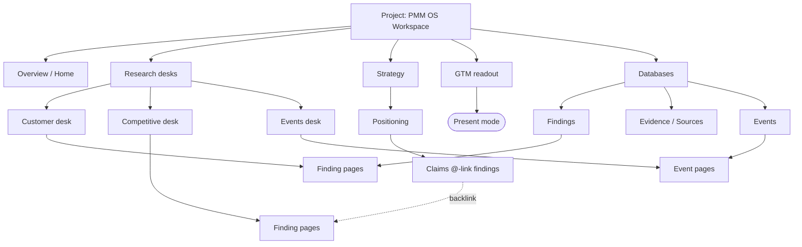
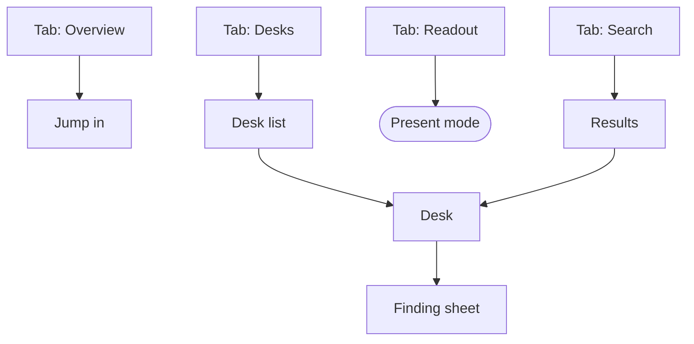

# Information Architecture: PMM OS Research Workspace

Organized by how a **PMM** thinks: "I have a project; it has **research desks**, the **strategy** I
drew from them, a **GTM readout** I present, and **databases** that cut across all of it." Shallow
(3 levels: Section → Page → Finding sub-page). The top level is the left page-tree = the future menu.

## Web sitemap (the desktop workspace — the real target)

- **Overview** (Home) — exec summary + project health
- **Research desks** *(section; each desk expands to its finding sub-pages)*
  - Product desk → findings
  - Customer desk → findings · (artifact: personas)
  - Competitive desk → findings · (artifact: matrix, battlecards)
  - Market desk → findings
  - Pricing desk → findings
  - Channels desk → findings
  - KOL desk → findings
  - Events desk → events
  - GTM desk → findings
- **Strategy** *(section)*
  - Positioning
  - Messaging
  - Narrative
  - Campaign
  - Coach review
- **GTM readout** (answer-first; → Present mode)
- **Databases** *(cross-cutting collections)*
  - Findings
  - Evidence / Sources
  - Events
- *Global (not tree nodes — overlays/actions):* Command palette · Global search · Present mode

## Mobile app map  *(DEFERRED — brief scopes v1 to desktop web; sketch only, do not build yet)*

If a read/present companion is built later, it collapses to a few tabs (no editing):
- **Tab: Overview** — exec summary, jump in
- **Tab: Desks** — list → desk → finding (drill stack); briefing-first, full report on tap
- **Tab: Readout** — the GTM readout → **Present mode is the killer mobile use** (present from a phone)
- **Tab: Search** — palette/search as a full screen
- Databases → filtered lists inside Desks/Search; Side peek → a full-screen **sheet** (no room for a side panel on mobile)

## Notes
- **Cross-links (it's a graph, not a pure tree):** a **Finding** lives under its Desk *and* in the
  Findings database *and* is reached via Strategy backlinks. A **Source** lives in Evidence *and*
  opens as a peek from any citation. **Events** desk ↔ Events database share the same records.
  Primary parent = the Desk; databases + backlinks are secondary entry points.
- **No auth / account section:** this is a generated single-file local app — no sign-up, billing, or
  settings tree. "Settings" is limited to a light view toggle (theme) + editor-server status.
- **Web-affordances used:** persistent left tree, deep-linkable pages (`#v-<page>`), a right side-peek
  (desktop has the width), keyboard-first palette.
- **Depth:** 3 levels max (Section → Page → Finding). The top level is **5 destinations** (Overview,
  Research desks, Strategy, GTM readout, Databases) — small enough to be the whole menu.

## Then
Top-level menu (web): **Overview · Research desks · Strategy · GTM readout · Databases**, 3 levels deep.
This grouping is my best guess at the PMM's mental model — **Phase 6 (card sort) validates it with you**,
and you may regroup (e.g. fold Strategy under the readout, or split Databases out as a power-user view).
